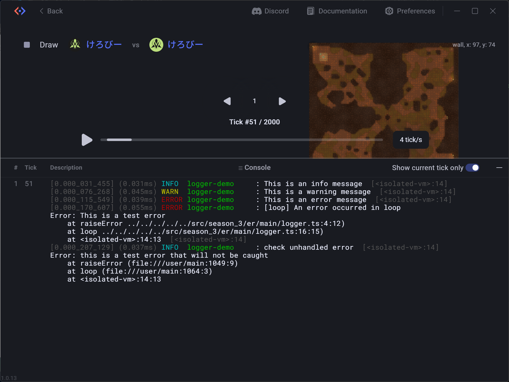

# Screeps Arena Build System

This repository uses an esbuild-centered build system that outputs two modes in parallel.

- dev: debug-friendly output
- prod: optimized production output

## Repository Highlights

- Used in practice by top-ranking Screeps Arena players.
- Uses a Dev Container setup, so local environment bootstrapping is not required.
- Uses both esbuild and tsgo:
- esbuild handles fast bundling/output generation.
- tsgo is used for type checking, including watch mode integration.
- Includes ready-to-use utility libraries:
- Common packages such as lodash are available out of the box.
- Logging-related packages (for example loglevel) are also preconfigured in dependencies.
- Provides a built-in logger utility:
- The shared logger is implemented in [src/common/logger.ts](src/common/logger.ts).
- It supports leveled logs, colored output, formatted timing output, and source-map-aware error display helpers.

## Overview

- Build engine: esbuild
- Entry discovery: glob
- Dynamic entry updates in watch mode: chokidar
- Type checking: tsgo

The main build configuration is in [esbuild.config.mjs](esbuild.config.mjs).

## Entry Point Rules

Current entry pattern:

- src/**/main/*.ts

This means every TypeScript file under a main directory is treated as a build entry.

Examples:

- src/season_3/er/main/simple-attack.ts
- src/season_3/er/main/simple-run.ts
- src/season_3/er/main/logger.ts
- src/season_3/ps/main/dummy.ts
- src/season_3/ss/main/dummy.ts

## Output Rules

Output root is dist.

- dev output: dist/.../dev/main.mjs
- prod output: dist/.../prod/main.mjs

Example:

- src/season_3/er/main/simple-attack.ts
- dist/season_3/er/simple-attack/dev/main.mjs
- dist/season_3/er/simple-attack/prod/main.mjs

## npm Scripts

- pnpm run build
- Runs dev -> prod builds.
- pnpm run build:prod
- Runs production build settings.
- pnpm run build:watch
- Starts watch mode for dev/prod outputs.
- pnpm run typecheck
- Runs type checking only with tsgo.

## Dev Container

This repository includes a ready-to-use Dev Container configuration in [.devcontainer/devcontainer.json](.devcontainer/devcontainer.json).

You can start coding without installing project-specific tools on your host machine.

How to use:

- Install Docker.
- Install the VS Code extension Dev Containers.
- Open this repository in VS Code.
- Run Dev Containers: Reopen in Container from the Command Palette.

What happens automatically:

- The container is built from [.devcontainer/Dockerfile](.devcontainer/Dockerfile).
- The post-create script [.devcontainer/postCreate.sh](.devcontainer/postCreate.sh) runs to initialize the workspace.
- Tool versions are printed on startup via postStartCommand.

## Watch Mode Behavior

Watch mode runs these components together:

- esbuild watch contexts
- tsgo type-check watch
- chokidar watcher for entry add/remove events

When a new entry file is added or removed, the system re-evaluates entry points and recreates esbuild contexts only when the entry set has actually changed.

This allows watch mode to pick up new strategy entries without restarting the process.

## Source Map Handling

- dev: inline source maps
- prod: no source maps

In dev mode, a custom post-process step embeds source map data into the generated bundle header to improve runtime error mapping.

## Notes

- Any .ts file under a main directory becomes an entry, including temporary test files.
- If you need temporary files, place them outside main directories.
- To narrow entry targets, edit configPatterns.default in [esbuild.config.mjs](esbuild.config.mjs).
